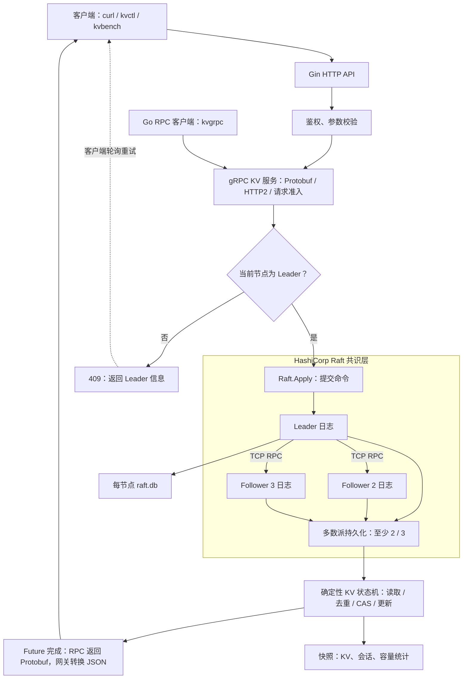
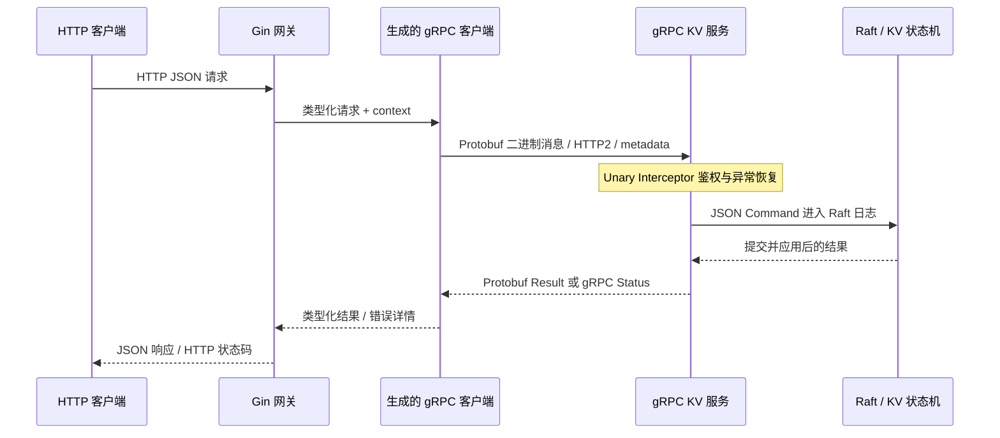
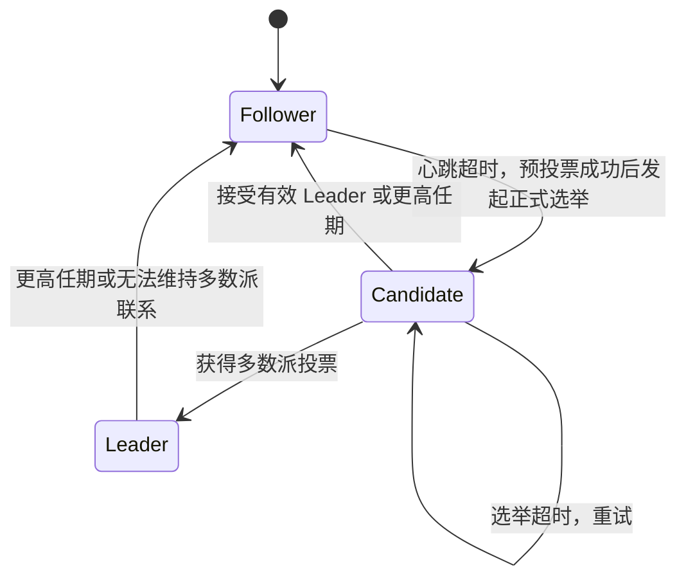
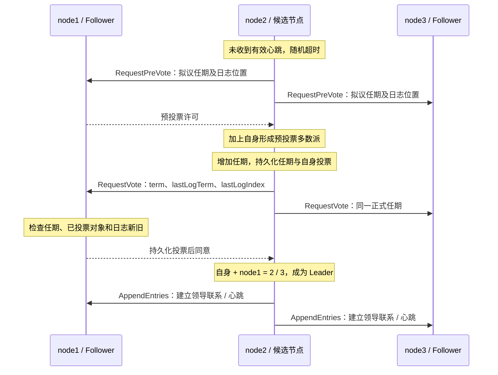
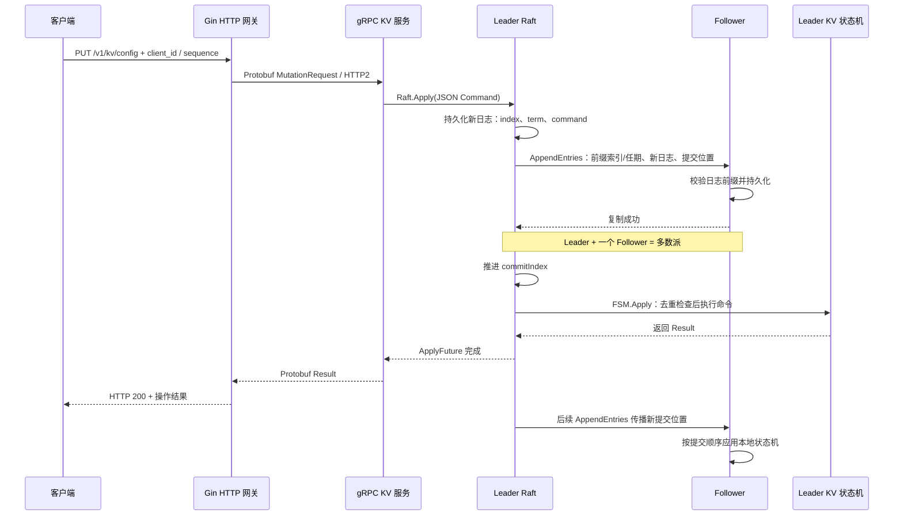
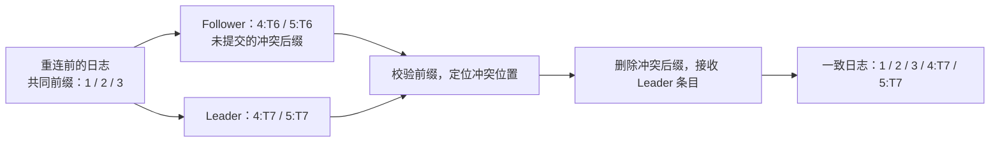
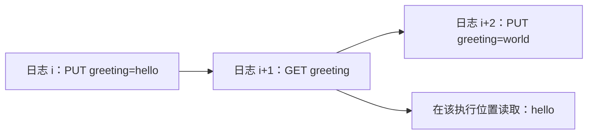
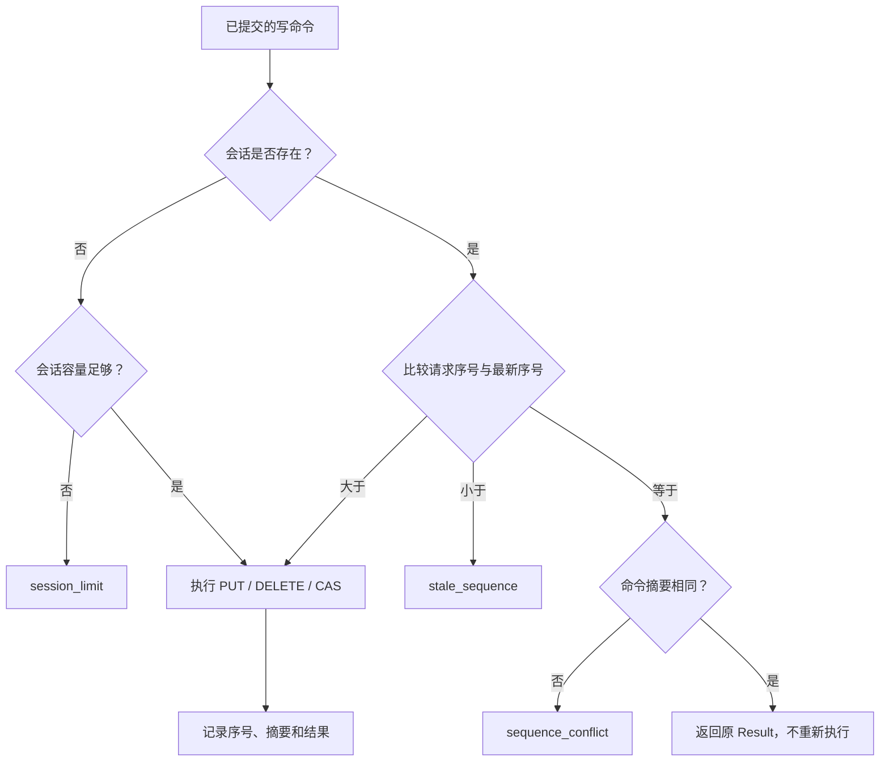
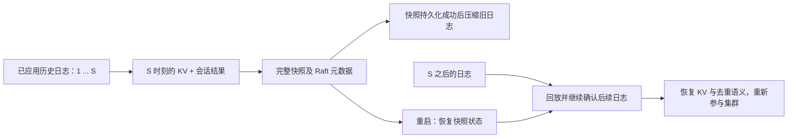
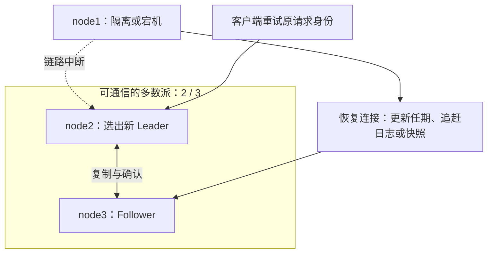

# RaftGo：基于 Gin 与 gRPC 的三节点分布式 KV 服务

当前版本的单元测试、竞态检查、三节点故障验证和实测性能见 [验证报告](docs/verification-grpc.md)。加入 RPC 之前的记录保存在 [初版验证报告](docs/verification.md)。

这是一个可运行的分布式存储后端项目：Gin 提供 HTTP 网关，gRPC + Protobuf 提供内部 KV 服务与二进制序列化协议，HashiCorp Raft 提供选举、复制、提交及快照调度，项目实现 KV 状态机、CAS、请求去重、强一致读、恢复、客户端及故障验证。

HTTP 客户端通过 Gin 网关访问服务，Gin 通过真实 TCP gRPC 连接调用同节点的 KV 后端；Go RPC 客户端也能直接调用该服务。节点之间通过 HashiCorp Raft 内置 TCP RPC 协作。系统将读写请求统一排序到复制日志中，在多数派确认后执行状态机，提供一致的 KV 操作结果。

## 项目概览

| 能力 | 设计 |
|---|---|
| 后端接口 | Gin 路由、JSON 校验、异常恢复、可选 Bearer Token |
| 内部 RPC | Protobuf 定义 KV 服务，生成 Go 客户端和服务端代码，gRPC 传输 |
| 共识与容错 | 三节点 Raft，多数派为 2，容忍 1 个节点不可用 |
| 数据操作 | Get / Put / Delete / CAS，区分不存在与空值 |
| 请求重试 | 客户端 ID、递增序号与命令摘要，保存最新响应 |
| 强一致读 | 读命令进入 Raft 日志，在状态机应用时读取 |
| 持久化 | bbolt 日志与稳定状态、KV 和会话快照、日志回放 |
| 工程运行 | Docker Compose、独立数据目录、资源限制、日志轮转 |
| 验证 | 单元测试、竞态检查、网络隔离、宕机、重启和压测 |

## 系统架构



图中以请求到达 Leader 为正常路径。Follower 不会在服务端自动转发请求；`kvctl` 遇到非 Leader 响应会轮询配置中的节点，使用相同写请求身份重试。每个副本都有自己的日志、状态机与数据目录，图中的日志和快照是各节点独立保存的资源。

## 内部 RPC 与 Protobuf 协议

每个节点运行两个服务：Gin 监听 HTTP 8080，gRPC 监听 9090。Gin 复用到本机 gRPC 服务的 `ClientConn`，通过生成的 `KVServiceClient` 调用 KV 后端。网关和后端目前在同一进程，但请求实际经过 TCP、HTTP/2、Protobuf 编解码和 gRPC 服务端处理。



### 协议边界

| 边界 | 协议与编码 | 用途 |
|---|---|---|
| HTTP 客户端到 Gin | HTTP + JSON | 浏览器、curl 和普通业务客户端 |
| Gin / Go RPC 客户端到 KV 后端 | gRPC + HTTP/2 + Protobuf | 类型化契约、二进制序列化、deadline 与取消传播 |
| Raft 节点之间 | HashiCorp TCP RPC + MessagePack | RequestVote、AppendEntries、InstallSnapshot 等共识通信 |
| 应用命令与状态快照 | JSON | 固定命令编码、兼容已有日志和快照 |

增加的是 KV 服务层 gRPC，不替换 HashiCorp Raft Transport，不改变现有 JSON 日志格式；已有节点数据可以继续恢复。Raft 节点间通信仍由 HashiCorp 内置传输负责。

完整契约见 [kv.proto](api/kv/v1/kv.proto)：

```protobuf
service KVService {
  rpc Get(GetRequest) returns (Result);
  rpc Put(MutationRequest) returns (Result);
  rpc Delete(MutationRequest) returns (Result);
  rpc CompareAndSwap(MutationRequest) returns (Result);
}
```

`MutationRequest` 包含 key、value、client_id、uint64 sequence、expected 和 expected_exists；`Result` 包含 value、exists、applied 和 error。字段编号是协议的一部分，演进时不能复用删除字段的编号。两种入口最终构造同一种状态机命令，相同内容和身份的原请求可以跨入口去重。

### 错误、鉴权与超时

| 场景 | gRPC 状态 | HTTP 网关映射 |
|---|---|---|
| 参数无效 | InvalidArgument | 400 |
| Token 不匹配 | Unauthenticated | 401 |
| 非 Leader / 失去领导权 | FailedPrecondition + NOT_LEADER | 409 |
| 同序号不同命令 | AlreadyExists + sequence_conflict | 409 |
| 旧序号 | FailedPrecondition + stale_sequence | 409 |
| 会话容量 / 待处理请求容量 | ResourceExhausted | 429 |
| KV 容量不足 | ResourceExhausted + store_full | 409 |
| Raft 不可用 / 超时 | Unavailable / DeadlineExceeded | 503 |

CAS 条件不匹配仍返回正常 Result、`applied:false`。错误通过 Protobuf `google.rpc.ErrorInfo` 携带原因、Leader 信息和重试提示。HTTP 和 gRPC 使用相同 `API_TOKEN`；RPC 服务端校验 authorization metadata，直接调用不能绕过鉴权及字段长度限制。

Gin 使用 7 秒 RPC deadline，后端等待 Raft 结果最多 6 秒，Raft 入队 timeout 为 5 秒。context 取消结束等待，但不能撤回已提交命令；不确定写入应保持原身份与内容重试。后端最多接纳 128 个尚未完成的提案，gRPC 单消息限制 1 MiB。当前 HTTP 与 gRPC 均未启用 TLS，发布端口仅绑定宿主机回环地址。

### 直接调用与重新生成

构建 gRPC 客户端：

```powershell
& 'D:\go_sdk\go1.27.1\bin\go.exe' build -tags nomsgpack -o bin/kvgrpc.exe ./cmd/kvgrpc
.\bin\kvgrpc.exe -client rpc-demo -seq 1 -value hello put rpc-key
.\bin\kvgrpc.exe get rpc-key
.\bin\kvgrpc.exe -client rpc-demo -seq 2 -expected hello -value world cas rpc-key
.\bin\kvgrpc.exe -client rpc-demo -seq 2 -expected hello -value world cas rpc-key
.\bin\kvgrpc.exe -client rpc-demo -seq 3 delete rpc-key
```

默认轮询 `127.0.0.1:19091`、`19092`、`19093`，使用 `-nodes` 指定其他地址。`API_TOKEN` 或 `-token` 提供鉴权；非 Leader、连接不可用、超时可以重试，身份冲突与鉴权失败不会盲目重试。状态接口的 `grpc_calls` 统计通过鉴权的调用，可用于确认 Gin 请求经过 RPC。

生成文件已随源码提供，正常构建不需要安装 protoc。修改协议后使用 protoc 32.1、protoc-gen-go v1.36.9 和 protoc-gen-go-grpc v1.5.1：

```powershell
.\scripts\generate-proto.ps1
# 工具在其他位置时传入 -Protoc 和 -PluginDir
```

本机工具保存在 `.cache/tools/`，不修改系统 PATH，不提交工具二进制。不要手工修改 `kv.pb.go` 和 `kv_grpc.pb.go`。


## Raft 选举：集群如何产生 Leader

Raft 将节点划分为 Follower、Candidate 和 Leader。任期 `term` 标记一轮领导权，节点遇到更高任期时更新任期并回到 Follower；同一任期内，一个投票节点最多支持一个候选者。



本项目使用 HashiCorp Raft v1.7.3 默认启用的预投票机制。预投票先询问是否有机会获得多数派，不立即持久化新的正式选举任期，减少长期隔离节点重新接入时对正常集群的干扰。下面展示 node2 发起并赢得选举的示例；node1 并不固定担任 Leader。



投票还要求候选者日志足够新：先比较最后一条日志的任期，再在任期相同时比较索引。节点的正式任期和投票信息写入稳定存储，重启不会清除“本任期已经投给谁”的约束。随机化超时降低多个节点同时参选导致反复分票的概率。

默认 `HeartbeatTimeout` 和 `ElectionTimeout` 配置值均为 1 秒，`LeaderLeaseTimeout` 为 500 毫秒；实际选主耗时还受随机超时、网络、调度与磁盘影响，这些参数不代表固定的故障恢复 SLA。配置来自 `raft.DefaultConfig()`，项目在此基础上设置节点身份及快照参数。

## 日志复制：一次写入怎样得到确认

客户端的写请求不会直接修改本地 Map。Gin 将请求转换为 Protobuf 消息交给 gRPC 后端，后端转换为 `Command`，Leader 把它作为日志提案复制，提交后各节点按相同顺序执行状态机。



成功响应不要求所有 Follower 都已应用，只要求日志满足 Raft 提交条件并且 Leader 状态机已执行。对一个三投票节点集群，多数派为 `floor(3/2)+1=2`。Leader 以多数派复制位置推进提交边界，并通过当前任期日志的提交来安全确定之前日志的提交。

| 概念 | 含义 | 查看位置 |
|---|---|---|
| 日志 `index` | 日志在复制序列中的位置 | 状态接口 `last_log_index` |
| 日志 `term` | 创建日志时的任期 | 状态接口 `last_log_term` |
| `commitIndex` | 已满足提交条件的日志边界 | 状态接口 `commit_index` |
| 应用进度 | 已交付状态机执行的日志进度 | 状态接口 `applied_index` |
| 副本复制进度 | Leader 跟踪每个 Follower 已复制位置及下一发送位置 | Raft 库内部 |

Follower 校验 `AppendEntries` 指定的前一条日志索引和任期。如果前缀不匹配，Leader 回退发送位置，寻找共同前缀，再发送后续日志；Follower 遇到冲突条目时删除冲突条目及其后缀，并接收 Leader 的日志。已经提交的历史由 Raft 安全性约束保护，不会作为普通冲突后缀随意覆盖。



若所需历史已被快照压缩，单纯回退日志不足以补齐，Leader 通过 `InstallSnapshot` 提供快照，再从快照边界之后继续复制。

## 强一致读、CAS 与请求去重

### 读取也进入共识序列

仅检查 `State()==Leader` 再读取本地内存，无法排除隔离的旧 Leader。本项目对 GET 同样调用 `Raft.Apply`，让读取在提交的命令序列中执行。



图中的索引是示例，表示已经确定的日志顺序，并不要求并发请求按网络到达时间排序。GET 也有日志复制和磁盘开销；当前实现没有使用 ReadIndex 或租约读。

### CAS 在状态机中比较并更新

CAS 比较键的存在标志和旧值，条件匹配才写入新值。比较与更新在同一次 `FSM.Apply` 中完成，不拆成先 GET 再 PUT。多个客户端并发对同一旧值 CAS 时，日志顺序决定执行先后，后执行者会看到先执行者的新值；本项目测试验证了同一旧值下恰好一个获胜者。

### 重试保存原操作结果

会话记录由 `client_id` 标识，保存最新 `sequence`、命令 SHA-256 摘要和 `Result`。写入和去重记录在同一次状态机应用中更新，并一起进入快照。



例如 CAS 已执行成功但响应丢失，再次发送原请求仍返回成功结果，避免第二次比较因值已经变化而返回失败。去重保护状态机效果，并不意味着重复请求完全不占用网络或 Raft 日志。每个会话只保留最新结果，因此客户端需要串行推进自身写序号；更旧请求会被明确拒绝。

## 快照与恢复

快照将某个应用边界上的状态转换为可恢复文件。`FSM.Snapshot()` 在读锁下序列化 KV、会话结果和容量统计，形成独立字节副本；随后 `Persist()` 写入快照，状态机可以继续处理后续命令。Raft 层保存对应的索引、任期与集群配置元数据。



恢复不能把磁盘上所有日志都视为已经提交。Raft 库负责恢复日志和共识进度，再按其提交与应用规则交付状态机。快照由节点独立生成；落后节点也可接收 Leader 的快照追赶。

本项目设置自动快照阈值 256 条日志、检查间隔 30 秒、保留 2 份快照、配置尾部日志保留数 128。手动快照通过 `/v1/admin/snapshot` 触发。快照不是数据库备份服务，也不等于永久失去多数派后的自动灾难恢复。

## 故障时如何继续服务



Leader 失去多数派联系后不能继续确认新命令，库会在相应超时条件下退回 Follower。其余两个节点可以重新选主；只有一个可通信节点时，读写接口都无法成功确认共识命令。超时请求可能已提交但响应未送达，客户端应保留原身份重试，而不是换一个新请求序号重复业务操作。

选举、复制、前缀校验和快照传输由 HashiCorp Raft 提供；Gin 网关、gRPC 后端、KV 状态机、会话协议和部署配置将这些能力组合成可以访问的后端服务。下面给出对应源码与运行方式。

## 源码结构

```text
main.go                    服务入口、健康检查、优雅退出
internal/server/           Raft 生命周期、Gin 网关、gRPC 后端与鉴权
api/kv/v1/                 Protobuf 协议及生成的消息和服务代码
internal/store/            KV/CAS 状态机、会话去重、快照与恢复
cmd/kvctl/                 支持节点轮询及失败重试的 HTTP 客户端
cmd/kvgrpc/                使用生成代码的 gRPC 客户端
cmd/kvbench/               固定请求数量的并发压测工具
scripts/verify.py          Docker 故障集成验证
scripts/start.ps1          Windows 启动脚本
scripts/build-local.ps1    本地交叉编译及运行镜像构建
data/node1..3/             三个节点独立持久化目录
```

KV 状态机在内存中执行。持久化由 Raft 日志（bbolt）和状态机快照共同实现，恢复时读取快照并回放日志；本项目没有使用 RocksDB，也没有单独的 KV 数据库。`raft.db` 保存 Raft 日志和稳定状态，`snapshots/` 保存 KV、会话结果和应用边界。

| 阅读入口 | 关键函数 | 对应流程 |
|---|---|---|
| [服务集成](internal/server/server.go) | `FromEnv` / `Open` | 校验身份、打开日志与快照存储、初始化集群 |
| [接口处理](internal/server/server.go) | `Router` / `execute` | Gin 校验、调用 gRPC Client、HTTP 错误映射 |
| [RPC 后端](internal/server/rpc.go) | `startRPC` / `applyRPC` | RPC 鉴权与校验、Raft 提交、返回 Protobuf 结果 |
| [KV 状态机](internal/store/fsm.go) | `Apply` | 读取、CAS、去重、容量核算及写入 |
| [状态快照](internal/store/fsm.go) | `Snapshot` / `Restore` | 独立状态副本、持久化与恢复 |
| [客户端](cmd/kvctl/main.go) | `main` | 节点轮询、失败重试、保持原写请求身份 |
| [集群测试](scripts/verify.py) | `main` | 网络隔离、宕机、重启、快照及多数派验证 |

## 本机快速启动

本机工程位于 `D:\go_prj`，Go SDK 为 `D:\go_sdk\go1.27.1`。需要 Go 1.27 工具链和运行中的 Docker Desktop（Linux 容器模式）；客户端构建使用 Go，故障验证额外需要 Python 3。GoLand 是可选编辑器，正常构建不需要 protoc。

从 GitHub 获取源码时，先在 PowerShell 中执行以下命令，再运行启动脚本。后续命令均在仓库根目录执行，示例中的 Go SDK 和缓存路径可按实际目录调整。

```powershell
git clone https://github.com/KNAIOS/RaftGo.git
cd RaftGo
```

```powershell
.\scripts\start.ps1 -LocalBuild
```

本地构建使用本机 Go SDK 编译 Linux/amd64 程序，Go 模块和编译缓存都位于本项目 `.cache/`，运行镜像固定到 distroless 镜像摘要。首次构建仍需下载 Go 依赖及运行镜像。本机已验证此路径。

如果需要自定义 Go SDK 路径：

```powershell
.\scripts\start.ps1 -LocalBuild -Go 'C:\path\to\go.exe'
```

也提供标准多阶段 Dockerfile，网络可访问 Docker Hub 时可用：

```powershell
.\scripts\start.ps1
```

首次验证时 Docker Hub 构建镜像下载超时，因此标准构建路径尚未在本机验证。本地构建模式已验证，不需要修改代理或 Docker 全局配置。

| 节点 | 本机 HTTP API | 本机 gRPC | 容器内 Raft 地址 | Windows 数据目录 |
|---|---|---|---|---|
| node1 | http://127.0.0.1:18081 | 127.0.0.1:19091 | node1:7000 | D:\go_prj\data\node1 |
| node2 | http://127.0.0.1:18082 | 127.0.0.1:19092 | node2:7000 | D:\go_prj\data\node2 |
| node3 | http://127.0.0.1:18083 | 127.0.0.1:19093 | node3:7000 | D:\go_prj\data\node3 |

三个 HTTP 端口和三个 gRPC 端口只绑定本机回环地址，Raft 端口不发布到宿主机。各容器限制为 1 CPU、512 MiB 内存，非 root、只读根文件系统，仅 `/data` 可写。容器应用日志最多保留 3 个 10 MB 文件。Docker 镜像存储与构建缓存由 Docker Desktop 的 D 盘磁盘镜像管理。

项目网络使用 `172.30.83.0/24`，三个节点固定为 `.11`、`.12`、`.13`，保持容器停止、重启与重新连接后的节点地址稳定，避免已建立的 Raft 连接因 IP 复用而连接到另一个节点。若该网段与本机已有网络冲突，应同时调整 Compose 子网、节点地址和集成测试地址表。由旧版动态网络升级时先执行 `docker compose down`，再运行启动脚本重建网络；宿主机数据目录保留。

node1 仅在自身没有任何 Raft 状态时初始化完整三节点配置；node2、node3 不重复初始化。首次至少需要两个节点在线才能选出 Leader。重启已有集群不会重新引导。

```powershell
docker compose ps
docker compose logs --tail 30
Invoke-RestMethod http://127.0.0.1:18081/v1/status
docker compose stop
docker compose start
```

`docker compose down` 删除本项目容器和网络，但保留宿主机数据。不要在已有集群中随意删除任一节点的 `data` 目录，也不要把删除全部数据当作常规重启方式。当前固定三节点，动态成员变更和失去多数派后的人工灾难恢复不在 API 范围内。

## GoLand 运行与客户端

GoLand 打开 `D:\go_prj`，设置 GOROOT 指向本机 Go SDK，模块无需额外配置。可将以下变量设在 GoLand 的当前运行配置中或当前 PowerShell 会话中，不必修改系统环境变量。

```powershell
$env:GOMODCACHE = 'D:\go_prj\.cache\mod'
$env:GOCACHE = 'D:\go_prj\.cache\build'
& 'D:\go_sdk\go1.27.1\bin\go.exe' build -tags nomsgpack -o bin/kvctl.exe ./cmd/kvctl
& 'D:\go_sdk\go1.27.1\bin\go.exe' build -tags nomsgpack -o bin/kvbench.exe ./cmd/kvbench
& 'D:\go_sdk\go1.27.1\bin\go.exe' build -tags nomsgpack -o bin/kvgrpc.exe ./cmd/kvgrpc
```

客户端会轮询三节点；遇到非 Leader、服务不可用或连接错误时，使用原请求身份重试。写请求必须显式指定稳定客户端 ID 和单调递增的序号：

```powershell
.\bin\kvctl.exe status
.\bin\kvctl.exe -client demo -seq 1 -value hello put greeting
.\bin\kvctl.exe get greeting
.\bin\kvctl.exe -client demo -seq 2 -expected hello -value world cas greeting
.\bin\kvctl.exe -client demo -seq 2 -expected hello -value world cas greeting
.\bin\kvctl.exe snapshot
.\bin\kvctl.exe -client demo -seq 3 delete greeting
```

第二次 CAS 使用相同序号，返回第一次的结果，不再执行 CAS。已经用过上述 demo 序号时，请使用新客户端 ID 或继续递增；不能把序号重新从 1 开始。

若直接本地启动单节点而不用 Docker，需要设置 `BOOTSTRAP=true`；默认环境配置使用 node1、127.0.0.1:7000、HTTP :8080、gRPC 127.0.0.1:9090 和 `data/node1`。**不要对 Docker 三节点数据目录启动本地单节点进程**；应设置另外的 `DATA_DIR`，例如 `data/standalone`。

## API

| 方法 | 路径 | 作用 |
|---|---|---|
| GET | `/healthz` | 存活检查，不代表有多数派 |
| GET | `/readyz` | 仅可确认多数派的 Leader 返回 200 |
| GET | `/v1/status` | 当前身份、Leader、Raft 统计信息 |
| GET | `/v1/kv/:key` | 强一致读，缺失键返回 `exists:false` |
| PUT | `/v1/kv/:key` | 写入 |
| DELETE | `/v1/kv/:key` | 删除，携带 JSON 请求体 |
| POST | `/v1/kv/:key/cas` | 原子比较并写入 |
| POST | `/v1/admin/snapshot` | 为当前节点生成快照 |

写入请求体：

```json
{"client_id":"my-client","sequence":1,"value":"hello"}
```

CAS 请求体：

```json
{"client_id":"my-client","sequence":2,"expected_exists":true,"expected":"hello","value":"world"}
```

`expected_exists:false` 表示期望键不存在，此时不比较 `expected` 字符串。存在的空字符串和不存在的键有不同含义。CAS 条件不匹配返回 HTTP 200、`applied:false`，不是通信失败。

```json
{"value":"world","exists":true,"applied":true}
```

`GET` 的 `applied` 为 false，因为读操作没有修改 KV。DELETE 返回删除前的值与存在标志，`applied:true` 表示删除命令已执行。接口限制键 256 字节、值/期望值 64 KiB、客户端 ID 128 字节、请求体 1 MiB。

非 Leader 返回 409 和 `leader_api`；客户端可改投该地址。Leader 不可用、超时或失去多数派返回 503。超时并不代表写入一定没有发生，必须使用原 `client_id + sequence + 内容` 重试。身份冲突、旧序号返回 409；会话容量或排队限制返回 429。

## 一致性与请求去重

- PUT、DELETE、CAS 都在多数派持久化且状态机执行后返回成功。
- GET 也通过 `Raft.Apply` 进入复制日志，在同一个确定性状态机中读取。读和写共享顺序，隔离节点不能成功提供强一致读。代价是读取也有磁盘和复制开销，后续可验证并改造为 ReadIndex 等方式。
- 一个客户端会话**只允许一个尚未确定结果的写请求**。序号必须单调递增，不必连续。会话只保留最新序号及对应结果；更旧请求明确拒绝，最新请求同内容重试返回原结果，同序号不同内容返回冲突。
- 同一客户端不能并发发送不同序号，除非调用方接受旧序号可能被拒绝。多个并发调用方使用不同 client_id。
- 去重结果与 KV 一起进入快照，恢复后仍有效。支持最多 10,000 个会话，不自动回收，避免删除去重记录后误执行旧请求。大规模生产使用需要正式的会话生命周期协议。
- 演示容量：最多 100,000 个键，键和值的原始字节总量最多 16 MiB；容量不足的写入返回 `store_full`，删除仍可释放空间。此限制不是磁盘配额。
- 约每 30～60 秒检查自动快照条件，阈值为 256 条日志，保留 2 份快照和至少 128 条尾部日志。bbolt 文件删除日志后可能保留已分配空间以便复用，不保证立即缩小，仍需监控磁盘。

## 鉴权

默认仅本机演示，不设置鉴权。需要启用时，复制 `.env.example` 为 `.env`，设置 `API_TOKEN`，重新创建容器，并在客户端进程设置同一值：

```powershell
$env:API_TOKEN = 'your-own-token'
.\bin\kvctl.exe status
```

除 `/healthz` 外的 HTTP 接口要求 `Authorization: Bearer <token>`；直接 gRPC 调用通过 authorization metadata 携带相同 Token，`kvgrpc` 自动读取 `API_TOKEN` 或 `-token`。Gin 使用常量时间比较，提供请求日志、异常恢复、参数验证和统一 JSON 错误。当前没有 TLS、用户权限系统或 Raft 传输加密；跨主机部署前需要设计这些配置，并将 `PEERS` 中的地址改成真实可访问的节点地址。

## 测试与故障验证

```powershell
& 'D:\go_sdk\go1.27.1\bin\go.exe' test -tags nomsgpack ./...
& 'D:\go_sdk\go1.27.1\bin\go.exe' vet -tags nomsgpack ./...
# 安装了 C 编译器的环境可启用 race 检查
& 'D:\go_sdk\go1.27.1\bin\go.exe' test -race -tags nomsgpack ./...
& 'D:\go_sdk\go1.27.1\bin\go.exe' build -tags nomsgpack -o bin/kvgrpc.exe ./cmd/kvgrpc
# 三节点容器已启动后执行
python scripts/verify.py
```

Python 验证仅使用标准库，直接执行 Docker CLI，测试会暂时隔离项目自己的 Leader 网络、杀死节点、重启集群、暂停两个节点；结束时尽量恢复三个节点。不要在业务使用中运行故障测试。集成测试创建唯一键和会话，不清空已有数据。

覆盖：读写/CAS、原请求重试、同序号不同内容、并发 CAS 单一获胜者、Leader 网络隔离与多数派选主、Leader SIGKILL、快照与整集群重启、重启后的去重、失去多数派时拒绝成功写入、删除。单元测试覆盖快照独立性、恢复、参数/鉴权和并发状态机访问。RPC 测试还覆盖真实 TCP 调用、HTTP/gRPC 交叉去重、错误码、取消与直接 RPC 参数限制。运行集群验证前需构建 bin/kvgrpc 客户端。

这些是定向一致性验证，不是完整 Jepsen/Porcupine 历史检查，也不证明所有故障组合的正确性。存储损坏注入、多机网络延迟和生产级长时间压力验证尚未实现。

## 压测

```powershell
.\bin\kvbench.exe -requests 1000 -workers 8 -value-size 128 -writes 20
```

输出请求数、并发数、值大小、写比例、失败数、吞吐与 P50/P95/P99；统计包含重试延迟。工具为每个 worker 创建独立键和会话，并检查读写返回内容。测试键和会话保留，重复运行会增加会话数量。只读强一致读也进入复制日志，压测前必须考虑这项开销。

当前版本通过 HTTP → Gin → gRPC → Raft → 状态机路径实测，使用固定 IP 的三节点部署；1000 次请求、8 并发、128 字节值、20% 写入：

| 指标 | 结果 |
|---|---|
| 失败数 | 0 |
| 总耗时 | 6.038 秒 |
| 吞吐 | 165.61 请求/秒 |
| P50 | 46.077 ms |
| P95 | 73.282 ms |
| P99 | 77.175 ms |

测量结束后三节点 `commit_index` 和 `applied_index` 均为 3146。详细条件、测试范围与限制见 [当前验证报告](docs/verification-grpc.md)，旧版数据见 [初版验证报告](docs/verification.md)。这些数值是一次已记录测量，不是性能承诺；单次新旧测量不足以判断 RPC 的稳定性能影响。

本机单宿主机 Docker 数据不能作为多主机容错或生产性能结论。三个容器可演示单节点故障，宿主机故障会同时失去三个节点。

## 上游组件

各直接及间接依赖的版本、版权与许可文本见 [第三方组件声明](THIRD_PARTY_NOTICES.md)。

- Gin：https://github.com/gin-gonic/gin （MIT）
- gRPC-Go：https://github.com/grpc/grpc-go （Apache-2.0）
- Protobuf Go：https://github.com/protocolbuffers/protobuf-go （BSD-3-Clause）
- HashiCorp Raft：https://github.com/hashicorp/raft （MPL-2.0）
- Raft bbolt 存储：https://github.com/hashicorp/raft-boltdb （MPL-2.0）

本项目调用上游库，不直接修改或复制上游算法实现。再分发时保留依赖对应的许可证与声明。
