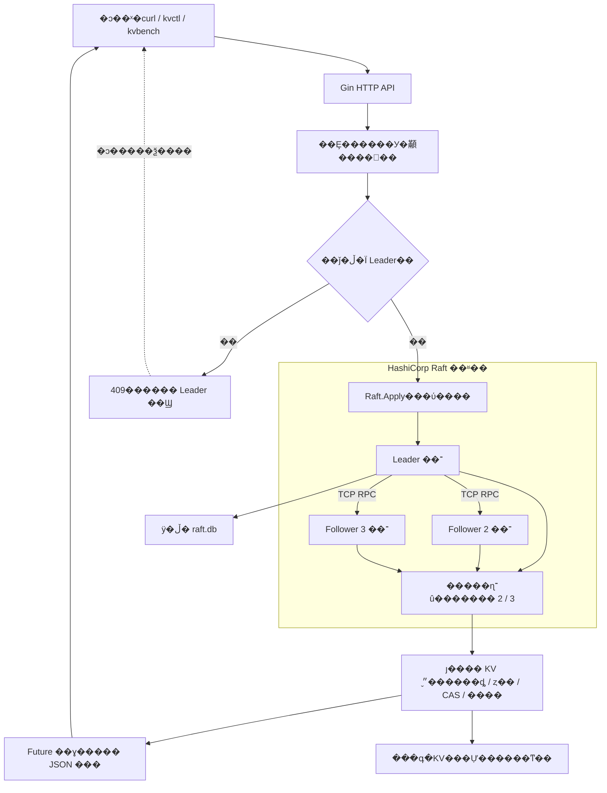
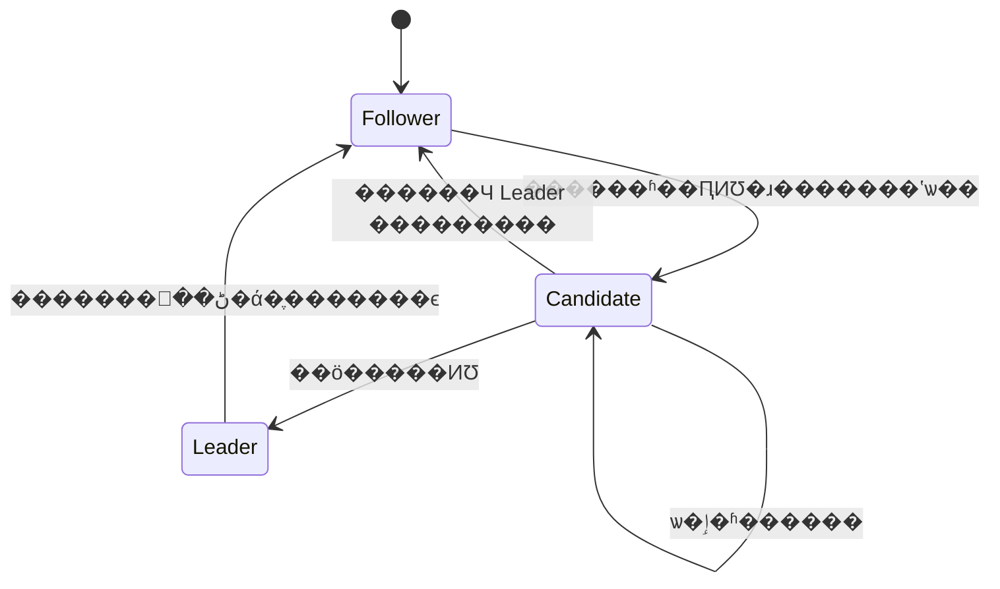
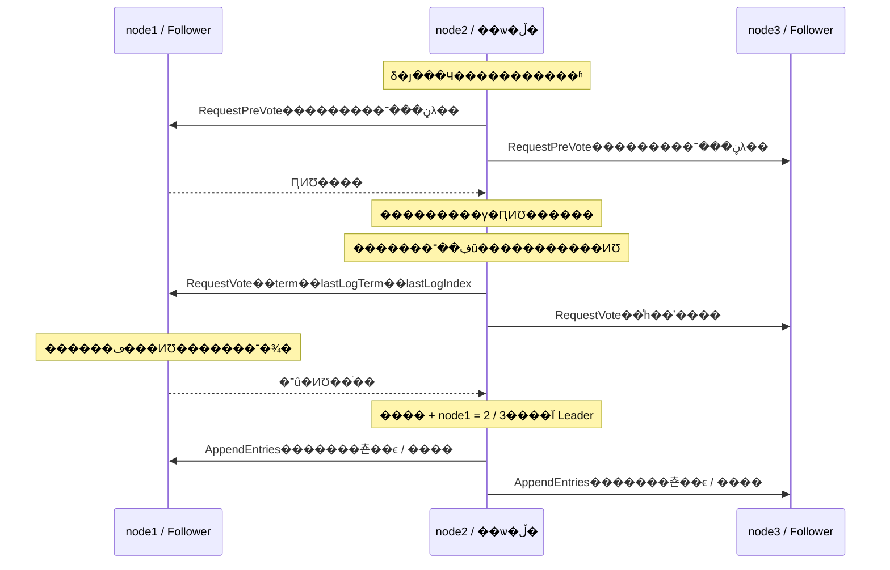
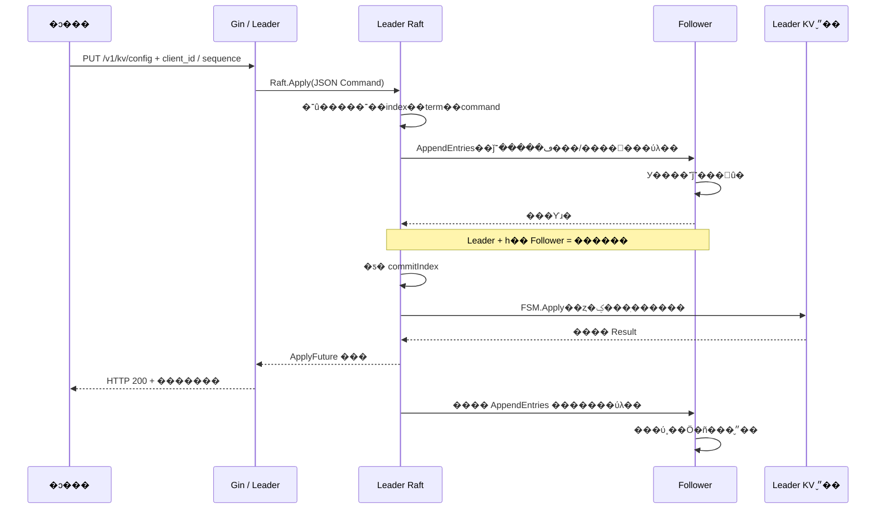
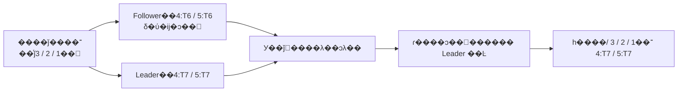
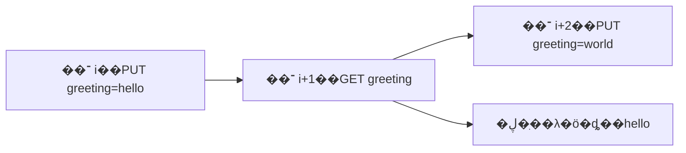
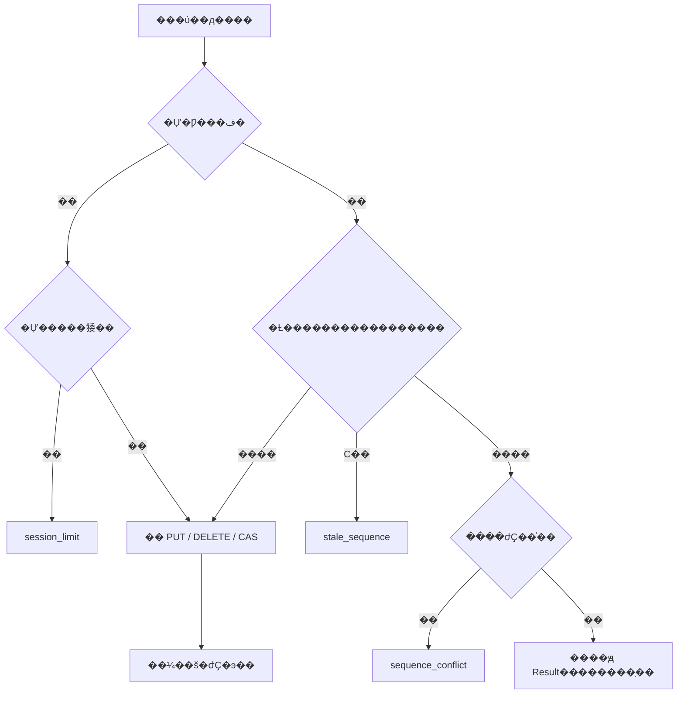
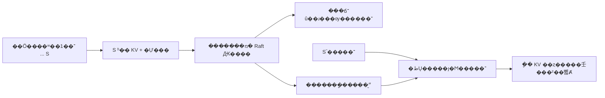
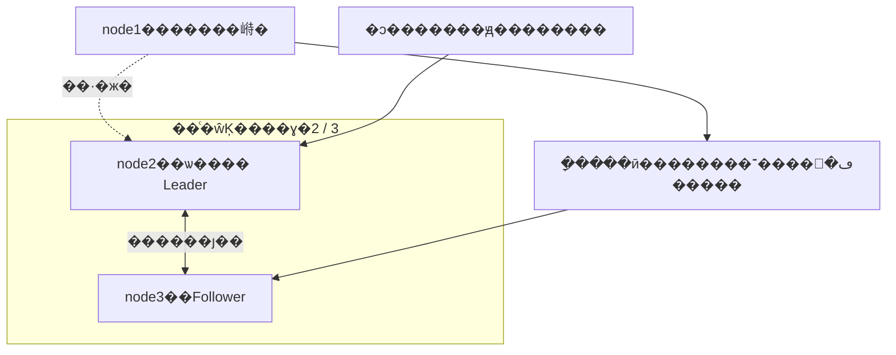

# RaftGo������ Go �� Gin �ķֲ�ʽ KV ����

����ɵı������Ժ�ʵ�����ܼ� [��֤����](docs/verification.md)��

����һ�������еķֲ�ʽ�洢�����Ŀ��Gin �ṩ HTTP API��HashiCorp Raft �ṩѡ�١����ơ��ύ�����յ��ȣ���Ŀʵ�� KV ״̬����CAS������ȥ�ء�ǿһ�¶����ָ����ͻ��˼�������֤��

�ͻ���ͨ�� HTTP ���ʷ��񣬽ڵ�֮��ͨ�� HashiCorp Raft ���� TCP RPC Э����ϵͳ����д����ͳһ���򵽸�����־�У��ڶ�����ȷ�Ϻ�ִ��״̬�����ṩһ�µ� KV ���������

## ��Ŀ����

| ���� | ��� |
|---|---|
| ��˽ӿ� | Gin ·�ɡ�JSON У�顢�쳣�ָ�����ѡ Bearer Token |
| ��ʶ���ݴ� | ���ڵ� Raft��������Ϊ 2������ 1 ���ڵ㲻���� |
| ���ݲ��� | Get / Put / Delete / CAS�����ֲ��������ֵ |
| �������� | �ͻ��� ID���������������ժҪ������������Ӧ |
| ǿһ�¶� | ��������� Raft ��־����״̬��Ӧ��ʱ��ȡ |
| �־û� | bbolt ��־���ȶ�״̬��KV �ͻỰ���ա���־�ط� |
| �������� | Docker Compose����������Ŀ¼����Դ���ơ���־��ת |
| ��֤ | ��Ԫ���ԡ���̬��顢������롢崻���������ѹ�� |

## ϵͳ�ܹ�



ͼ�������󵽴� Leader Ϊ����·����Follower �����ڷ�����Զ�ת������`kvctl` ������ Leader ��Ӧ����ѯ�����еĽڵ㣬ʹ����ͬд�����������ԡ�ÿ�����������Լ�����־��״̬��������Ŀ¼��ͼ�е���־�Ϳ����Ǹ��ڵ�����������Դ��

## Raft ѡ�٣���Ⱥ��β��� Leader

Raft ���ڵ㻮��Ϊ Follower��Candidate �� Leader������ `term` ���һ���쵼Ȩ���ڵ�������������ʱ�������ڲ��ص� Follower��ͬһ�����ڣ�һ��ͶƱ�ڵ����֧��һ����ѡ�ߡ�



����Ŀʹ�� HashiCorp Raft v1.7.3 Ĭ�����õ�ԤͶƱ���ơ�ԤͶƱ��ѯ���Ƿ��л����ö����ɣ��������־û��µ���ʽѡ�����ڣ����ٳ��ڸ���ڵ����½���ʱ��������Ⱥ�ĸ��š�����չʾ node2 ����Ӯ��ѡ�ٵ�ʾ����node1 �����̶����� Leader��



ͶƱ��Ҫ���ѡ����־�㹻�£��ȱȽ����һ����־�����ڣ�����������ͬʱ�Ƚ��������ڵ����ʽ���ں�ͶƱ��Ϣд���ȶ��洢����������������������Ѿ�Ͷ��˭����Լ�����������ʱ���Ͷ���ڵ�ͬʱ��ѡ���·�����Ʊ�ĸ��ʡ�

Ĭ�� `HeartbeatTimeout` �� `ElectionTimeout` ����ֵ��Ϊ 1 �룬`LeaderLeaseTimeout` Ϊ 500 ���룻ʵ��ѡ����ʱ���������ʱ�����硢���������Ӱ�죬��Щ�����������̶��Ĺ��ϻָ� SLA���������� `raft.DefaultConfig()`����Ŀ�ڴ˻��������ýڵ����ݼ����ղ�����

## ��־���ƣ�һ��д�������õ�ȷ��

�ͻ��˵�д���󲻻�ֱ���޸ı��� Map��Gin ������ת��Ϊ `Command`��Leader ������Ϊ��־�᰸���ƣ��ύ����ڵ㰴��ͬ˳��ִ��״̬����



�ɹ���Ӧ��Ҫ������ Follower ����Ӧ�ã�ֻҪ����־���� Raft �ύ�������� Leader ״̬����ִ�С���һ����ͶƱ�ڵ㼯Ⱥ��������Ϊ `floor(3/2)+1=2`��Leader �Զ����ɸ���λ���ƽ��ύ�߽磬��ͨ����ǰ������־���ύ����ȫȷ��֮ǰ��־���ύ��

| ���� | ���� | �鿴λ�� |
|---|---|---|
| ��־ `index` | ��־�ڸ��������е�λ�� | ״̬�ӿ� `last_log_index` |
| ��־ `term` | ������־ʱ������ | ״̬�ӿ� `last_log_term` |
| `commitIndex` | �������ύ��������־�߽� | ״̬�ӿ� `commit_index` |
| Ӧ�ý��� | �ѽ���״̬��ִ�е���־���� | ״̬�ӿ� `applied_index` |
| �������ƽ��� | Leader ����ÿ�� Follower �Ѹ���λ�ü���һ����λ�� | Raft ���ڲ� |

Follower У�� `AppendEntries` ָ����ǰһ����־���������ڡ����ǰ׺��ƥ�䣬Leader ���˷���λ�ã�Ѱ�ҹ�ͬǰ׺���ٷ��ͺ�����־��Follower ������ͻ��Ŀʱɾ����ͻ��Ŀ�����׺�������� Leader ����־���Ѿ��ύ����ʷ�� Raft ��ȫ��Լ��������������Ϊ��ͨ��ͻ��׺���⸲�ǡ�



��������ʷ�ѱ�����ѹ��������������־�����Բ��룬Leader ͨ�� `InstallSnapshot` �ṩ���գ��ٴӿ��ձ߽�֮��������ơ�

## ǿһ�¶���CAS ������ȥ��

### ��ȡҲ���빲ʶ����

����� `State()==Leader` �ٶ�ȡ�����ڴ棬�޷��ų�����ľ� Leader������Ŀ�� GET ͬ������ `Raft.Apply`���ö�ȡ���ύ������������ִ�С�



ͼ�е�������ʾ������ʾ�Ѿ�ȷ������־˳�򣬲���Ҫ�󲢷��������絽��ʱ������GET Ҳ����־���ƺʹ��̿�������ǰʵ��û��ʹ�� ReadIndex ����Լ����

### CAS ��״̬���бȽϲ�����

CAS �Ƚϼ��Ĵ��ڱ�־�;�ֵ������ƥ���д����ֵ���Ƚ��������ͬһ�� `FSM.Apply` ����ɣ�������� GET �� PUT������ͻ��˲�����ͬһ��ֵ CAS ʱ����־˳�����ִ���Ⱥ󣬺�ִ���߻ῴ����ִ���ߵ���ֵ������Ŀ������֤��ͬһ��ֵ��ǡ��һ����ʤ�ߡ�

### ���Ա���ԭ�������

�Ự��¼�� `client_id` ��ʶ���������� `sequence`������ SHA-256 ժҪ�� `Result`��д���ȥ�ؼ�¼��ͬһ��״̬��Ӧ���и��£���һ�������ա�



���� CAS ��ִ�гɹ�����Ӧ��ʧ���ٴη���ԭ�����Է��سɹ����������ڶ��αȽ���ֵ�Ѿ��仯������ʧ�ܡ�ȥ�ر���״̬��Ч����������ζ���ظ�������ȫ��ռ������� Raft ��־��ÿ���Ựֻ�������½������˿ͻ�����Ҫ�����ƽ�����д��ţ���������ᱻ��ȷ�ܾ���

## ������ָ�

���ս�ij��Ӧ�ñ߽��ϵ�״̬ת��Ϊ�ɻָ��ļ���`FSM.Snapshot()` �ڶ��������л� KV���Ự���������ͳ�ƣ��γɶ����ֽڸ�������� `Persist()` д����գ�״̬�����Լ��������������Raft �㱣���Ӧ�������������뼯Ⱥ����Ԫ���ݡ�



�ָ����ܰѴ�����������־����Ϊ�Ѿ��ύ��Raft �⸺��ָ���־�͹�ʶ���ȣ��ٰ����ύ��Ӧ�ù��򽻸�״̬���������ɽڵ�������ɣ����ڵ�Ҳ�ɽ��� Leader �Ŀ���׷�ϡ�

����Ŀ�����Զ�������ֵ 256 ����־������� 30 �롢���� 2 �ݿ��ա�����β����־������ 128���ֶ�����ͨ�� `/v1/admin/snapshot` ���������ղ������ݿⱸ�ݷ���Ҳ����������ʧȥ�����ɺ���Զ����ѻָ���

## ����ʱ��μ�������



Leader ʧȥ��������ϵ���ܼ���ȷ��������������Ӧ��ʱ�������˻� Follower�����������ڵ��������ѡ����ֻ��һ����ͨ�Žڵ�ʱ����д�ӿڶ��޷��ɹ�ȷ�Ϲ�ʶ�����ʱ����������ύ����Ӧδ�ʹ�ͻ���Ӧ����ԭ�������ԣ������ǻ�һ������������ظ�ҵ�������

ѡ�١����ơ�ǰ׺У��Ϳ��մ����� HashiCorp Raft �ṩ��Gin ·�ɡ�KV ״̬�����ỰЭ��Ͳ������ý���Щ������ϳɿ��Է��ʵĺ�˷������������ӦԴ�������з�ʽ��

## Դ��ṹ

```text
main.go                    ������ڡ�������顢�����˳�
internal/server/           ���á�Raft �������ڡ�Gin ·�����Ȩ
internal/store/            KV/CAS ״̬�����Ựȥ�ء�������ָ�
cmd/kvctl/                 ֧�ֽڵ���ѯ��ʧ�����Ե� Go �ͻ���
cmd/kvbench/               �̶����������IJ���ѹ�⹤��
scripts/verify.py          Docker ���ϼ�����֤
scripts/start.ps1          Windows �����ű�
scripts/build-local.ps1    ���ؽ�����뼰���о��񹹽�
data/node1..3/             �����ڵ�����־û�Ŀ¼
```

KV ״̬�����ڴ���ִ�С��־û��� Raft ��־��bbolt����״̬�����չ�ͬʵ�֣��ָ�ʱ��ȡ���ղ��ط���־������Ŀû��ʹ�� RocksDB��Ҳû�е����� KV ���ݿ⡣`raft.db` ���� Raft ��־���ȶ�״̬��`snapshots/` ���� KV���Ự�����Ӧ�ñ߽硣

| �Ķ���� | �ؼ����� | ��Ӧ���� |
|---|---|---|
| [���񼯳�](internal/server/server.go) | `FromEnv` / `Open` | У�����ݡ�����־����մ洢����ʼ����Ⱥ |
| [�ӿڴ���](internal/server/server.go) | `Router` / `execute` | Gin У�顢Leader ��顢����׼�롢�ȴ� ApplyFuture |
| [KV ״̬��](internal/store/fsm.go) | `Apply` | ��ȡ��CAS��ȥ�ء��������㼰д�� |
| [״̬����](internal/store/fsm.go) | `Snapshot` / `Restore` | ����״̬�������־û���ָ� |
| [�ͻ���](cmd/kvctl/main.go) | `main` | �ڵ���ѯ��ʧ�����ԡ�����ԭд�������� |
| [��Ⱥ����](scripts/verify.py) | `main` | ������롢崻������������ռ���������֤ |

## ������������

�� `D:\go_prj` �´� PowerShell���Ѿ���װ�� Go SDK Ϊ `D:\go_sdk\go1.27.1`��Docker Desktop ���뱣�����С�

```powershell
.\scripts\start.ps1 -LocalBuild
```

���ع���ʹ�ñ��� Go SDK ���� Linux/amd64 ����Go ģ��ͱ��뻺�涼λ�ڱ���Ŀ `.cache/`�����о���̶��� distroless ����ժҪ���״ι����������� Go ���������о��񡣱�������֤��·����

�����Ҫ�Զ��� Go SDK ·����

```powershell
.\scripts\start.ps1 -LocalBuild -Go 'C:\path\to\go.exe'
```

Ҳ�ṩ��׼��׶� Dockerfile������ɷ��� Docker Hub ʱ���ã�

```powershell
.\scripts\start.ps1
```

�״���֤ʱ Docker Hub �����������س�ʱ����˱�׼����·����δ�ڱ�����֤�����ع���ģʽ����֤������Ҫ�޸Ĵ����� Docker ȫ�����á�

| �ڵ� | ���� API | ������ Raft ��ַ | Windows ����Ŀ¼ |
|---|---|---|---|
| node1 | http://127.0.0.1:18081 | node1:7000 | D:\go_prj\data\node1 |
| node2 | http://127.0.0.1:18082 | node2:7000 | D:\go_prj\data\node2 |
| node3 | http://127.0.0.1:18083 | node3:7000 | D:\go_prj\data\node3 |

���� API ֻ�󶨱����ػ���ַ��Raft �˿ڲ�������������������������Ϊ 1 CPU��512 MiB �ڴ棬�� root��ֻ�����ļ�ϵͳ���� `/data` ��д������Ӧ����־��ౣ�� 3 �� 10 MB �ļ���Docker ����洢�빹�������� Docker Desktop �� D �̴��̾��������

node1 ��������û���κ� Raft ״̬ʱ��ʼ���������ڵ����ã�node2��node3 ���ظ���ʼ�����״�������Ҫ�����ڵ����߲���ѡ�� Leader���������м�Ⱥ��������������

```powershell
docker compose ps
docker compose logs --tail 30
Invoke-RestMethod http://127.0.0.1:18081/v1/status
docker compose stop
docker compose start
```

`docker compose down` ɾ������Ŀ���������磬���������������ݡ���Ҫ�����м�Ⱥ������ɾ����һ�ڵ�� `data` Ŀ¼��Ҳ��Ҫ��ɾ��ȫ�����ݵ�������������ʽ����ǰ�̶����ڵ㣬��̬��Ա�����ʧȥ�����ɺ���˹����ѻָ����� API ��Χ�ڡ�

## GoLand ������ͻ���

GoLand �� `D:\go_prj`������ GOROOT ָ�򱾻� Go SDK��ģ������������á��ɽ����±������� GoLand �ĵ�ǰ���������л�ǰ PowerShell �Ự�У������޸�ϵͳ����������

```powershell
$env:GOMODCACHE = 'D:\go_prj\.cache\mod'
$env:GOCACHE = 'D:\go_prj\.cache\build'
& 'D:\go_sdk\go1.27.1\bin\go.exe' build -tags nomsgpack -o bin/kvctl.exe ./cmd/kvctl
& 'D:\go_sdk\go1.27.1\bin\go.exe' build -tags nomsgpack -o bin/kvbench.exe ./cmd/kvbench
```

�ͻ��˻���ѯ���ڵ㣻������ Leader�����񲻿��û����Ӵ���ʱ��ʹ��ԭ�����������ԡ�д���������ʽָ���ȶ��ͻ��� ID �͵�����������ţ�

```powershell
.\bin\kvctl.exe status
.\bin\kvctl.exe -client demo -seq 1 -value hello put greeting
.\bin\kvctl.exe get greeting
.\bin\kvctl.exe -client demo -seq 2 -expected hello -value world cas greeting
.\bin\kvctl.exe -client demo -seq 2 -expected hello -value world cas greeting
.\bin\kvctl.exe snapshot
.\bin\kvctl.exe -client demo -seq 3 delete greeting
```

�ڶ��� CAS ʹ����ͬ��ţ����ص�һ�εĽ��������ִ�� CAS���Ѿ��ù����� demo ���ʱ����ʹ���¿ͻ��� ID ��������������ܰ�������´� 1 ��ʼ��

��ֱ�ӱ����������ڵ������ Docker����Ҫ���� `BOOTSTRAP=true`��Ĭ�ϻ�������ʹ�� node1��127.0.0.1:7000��HTTP :8080 �� `data/node1`��**��Ҫ�� Docker ���ڵ�����Ŀ¼�������ص��ڵ����**��Ӧ��������� `DATA_DIR`������ `data/standalone`��

## API

| ���� | ·�� | ���� |
|---|---|---|
| GET | `/healthz` | ����飬�������ж����� |
| GET | `/readyz` | ����ȷ�϶����ɵ� Leader ���� 200 |
| GET | `/v1/status` | ��ǰ���ݡ�Leader��Raft ͳ����Ϣ |
| GET | `/v1/kv/:key` | ǿһ�¶���ȱʧ������ `exists:false` |
| PUT | `/v1/kv/:key` | � |
| DELETE | `/v1/kv/:key` | ɾ����Я�� JSON ������ |
| POST | `/v1/kv/:key/cas` | ԭ�ӱȽϲ�д�� |
| POST | `/v1/admin/snapshot` | Ϊ��ǰ�ڵ����ɿ��� |

д�������壺

```json
{"client_id":"my-client","sequence":1,"value":"hello"}
```

CAS �����壺

```json
{"client_id":"my-client","sequence":2,"expected_exists":true,"expected":"hello","value":"world"}
```

`expected_exists:false` ��ʾ�����������ڣ���ʱ���Ƚ� `expected` �ַ��������ڵĿ��ַ����Ͳ����ڵļ��в�ͬ���塣CAS ������ƥ�䷵�� HTTP 200��`applied:false`������ͨ��ʧ�ܡ�

```json
{"value":"world","exists":true,"applied":true}
```

`GET` �� `applied` Ϊ false����Ϊ������û���޸� KV��DELETE ����ɾ��ǰ��ֵ����ڱ�־��`applied:true` ��ʾɾ��������ִ�С��ӿ����Ƽ� 256 �ֽڡ�ֵ/����ֵ 64 KiB���ͻ��� ID 128 �ֽڡ������� 1 MiB��

�� Leader ���� 409 �� `leader_api`���ͻ��˿ɸ�Ͷ�õ�ַ��Leader �����á���ʱ��ʧȥ�����ɷ��� 503����ʱ��������д��һ��û�з���������ʹ��ԭ `client_id + sequence + ����` ���ԡ����ݳ�ͻ������ŷ��� 409���Ự�������Ŷ����Ʒ��� 429��

## һ����������ȥ��

- PUT��DELETE��CAS ���ڶ����ɳ־û���״̬��ִ�к󷵻سɹ���
- GET Ҳͨ�� `Raft.Apply` ���븴����־����ͬһ��ȷ����״̬���ж�ȡ������д����˳�򣬸���ڵ㲻�ܳɹ��ṩǿһ�¶��������Ƕ�ȡҲ�д��̺͸��ƿ�������������֤������Ϊ ReadIndex �ȷ�ʽ��
- һ���ͻ��˻Ự**ֻ����һ����δȷ�������д����**����ű��뵥�������������������Ựֻ����������ż���Ӧ���������������ȷ�ܾ�����������ͬ�������Է���ԭ�����ͬ��Ų�ͬ���ݷ��س�ͻ��
- ͬһ�ͻ��˲��ܲ������Ͳ�ͬ��ţ����ǵ��÷����ܾ���ſ��ܱ��ܾ�������������÷�ʹ�ò�ͬ client_id��
- ȥ�ؽ���� KV һ�������գ��ָ�������Ч��֧����� 10,000 ���Ự�����Զ����գ�����ɾ��ȥ�ؼ�¼����ִ�о����󡣴��ģ����ʹ����Ҫ��ʽ�ĻỰ��������Э�顣
- ��ʾ��������� 100,000 ����������ֵ��ԭʼ�ֽ�������� 16 MiB�����������д�뷵�� `store_full`��ɾ���Կ��ͷſռ䡣�����Ʋ��Ǵ�����
- Լÿ 30��60 �����Զ�������������ֵΪ 256 ����־������ 2 �ݿ��պ����� 128 ��β����־��bbolt �ļ�ɾ����־����ܱ����ѷ���ռ��Ա㸴�ã�����֤������С�������ش��̡�

## ��Ȩ

Ĭ�Ͻ�������ʾ�������ü�Ȩ����Ҫ����ʱ������ `.env.example` Ϊ `.env`������ `API_TOKEN`�����´������������ڿͻ��˽�������ͬһֵ��

```powershell
$env:API_TOKEN = 'your-own-token'
.\bin\kvctl.exe status
```

�� `/healthz` ��Ľӿ�Ҫ�� `Authorization: Bearer <token>`��Gin ʹ�ó���ʱ��Ƚϣ��ṩ������־���쳣�ָ���������֤��ͳһ JSON ���󡣵�ǰû�� TLS���û�Ȩ��ϵͳ�� Raft ������ܣ�����������ǰ��Ҫ�����Щ���ã����� `PEERS` �еĵ�ַ�ij���ʵ�ɷ��ʵĽڵ��ַ��

## �����������֤

```powershell
& 'D:\go_sdk\go1.27.1\bin\go.exe' test -tags nomsgpack ./...
& 'D:\go_sdk\go1.27.1\bin\go.exe' vet -tags nomsgpack ./...
# ��װ�� C �������Ļ��������� race ���
& 'D:\go_sdk\go1.27.1\bin\go.exe' test -race -tags nomsgpack ./...
python scripts/verify.py
```

Python ��֤��ʹ�ñ�׼�⣬ֱ��ִ�� Docker CLI�����Ի���ʱ������Ŀ�Լ��� Leader ���硢ɱ���ڵ㡢������Ⱥ����ͣ�����ڵ㣻����ʱ�����ָ������ڵ㡣��Ҫ��ҵ��ʹ�������й��ϲ��ԡ����ɲ��Դ���Ψһ���ͻỰ��������������ݡ�

���ǣ���д/CAS��ԭ�������ԡ�ͬ��Ų�ͬ���ݡ����� CAS ��һ��ʤ�ߡ�Leader ��������������ѡ����Leader SIGKILL������������Ⱥ�������������ȥ�ء�ʧȥ������ʱ�ܾ��ɹ�д�롢ɾ������Ԫ���Ը��ǿ��ն����ԡ��ָ�������/��Ȩ�Ͳ���״̬�����ʡ�

��Щ�Ƕ���һ������֤���������� Jepsen/Porcupine ��ʷ��飬Ҳ��֤�����й�����ϵ���ȷ�ԡ��洢��ע�롢��������ӳٺ���������ʱ��ѹ����֤��δʵ�֡�

## ѹ��

```powershell
.\bin\kvbench.exe -requests 1000 -workers 8 -value-size 128 -writes 20
```

�������������������ֵ��С��д������ʧ������������ P50/P95/P99��ͳ�ư��������ӳ١�����Ϊÿ�� worker �����������ͻỰ��������д�������ݡ����Լ��ͻỰ�������ظ����л����ӻỰ������ֻ��ǿһ�¶�Ҳ���븴����־��ѹ��ǰ���뿼���������

�����Ѽ�¼��ʾ�������1000 ������8 ������128 �ֽ�ֵ��20% д�룬ʧ���� 0������Լ 244.57 ����/�룬P50 Ϊ 32.603 ms��P95 Ϊ 42.226 ms��P99 Ϊ 48.397 ms��Ӳ������Դ��������Է�Χ�� [��֤����](docs/verification.md)����Щ��ֵ��һ���Ѽ�¼�������������ܳ�ŵ��

������������ Docker ���ݲ�����Ϊ�������ݴ����������ܽ��ۡ�������������ʾ���ڵ���ϣ����������ϻ�ͬʱʧȥ�����ڵ㡣

## �������

��ֱ�Ӽ���������İ汾����Ȩ�������ı��� [�������������](THIRD_PARTY_NOTICES.md)��

- Gin��https://github.com/gin-gonic/gin ��MIT��
- HashiCorp Raft��https://github.com/hashicorp/raft ��MPL-2.0��
- Raft bbolt �洢��https://github.com/hashicorp/raft-boltdb ��MPL-2.0��

����Ŀ�������ο⣬��ֱ���޸Ļ��������㷨ʵ�֡��ٷַ�ʱ����������Ӧ������֤��������
