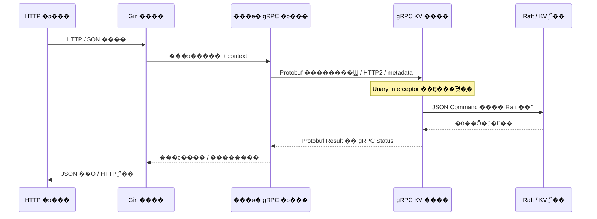

# �ڲ� RPC �� Protobuf Э��

ÿ���ڵ�������������Gin ���� HTTP 8080��gRPC ���� 9090��Gin ���õ����� gRPC ����� `ClientConn`��ͨ�����ɵ� `KVServiceClient` ���� KV ��ˡ����غͺ��Ŀǰ��ͬһ���̣�������ʵ�ʾ��� TCP��HTTP/2��Protobuf ������ gRPC ����˴�����



## Э��߽�

| �߽� | Э������� | ��; |
|---|---|---|
| HTTP �ͻ��˵� Gin | HTTP + JSON | �������curl ����ͨҵ��ͻ��� |
| Gin / Go RPC �ͻ��˵� KV ��� | gRPC + HTTP/2 + Protobuf | ���ͻ���Լ�����������л���deadline ��ȡ������ |
| Raft �ڵ�֮�� | HashiCorp TCP RPC + MessagePack | RequestVote��AppendEntries��InstallSnapshot �ȹ�ʶͨ�� |
| Ӧ��������״̬���� | JSON | �̶�������롢����������־�Ϳ��� |

���ӵ��� KV ����� gRPC�����滻 HashiCorp Raft Transport�����ı����� JSON ��־��ʽ�����нڵ����ݿ��Լ����ָ���Raft �ڵ��ͨ������ HashiCorp ���ô��为��

������Լ�� [kv.proto](../api/kv/v1/kv.proto)��

```protobuf
service KVService {
  rpc Get(GetRequest) returns (Result);
  rpc Put(MutationRequest) returns (Result);
  rpc Delete(MutationRequest) returns (Result);
  rpc CompareAndSwap(MutationRequest) returns (Result);
}
```

`MutationRequest` ���� key��value��client_id��uint64 sequence��expected �� expected_exists��`Result` ���� value��exists��applied �� error���ֶα����Э���һ���֣��ݽ�ʱ���ܸ���ɾ���ֶεı�š�����������չ���ͬһ��״̬�������ͬ���ݺ����ݵ�ԭ������Կ����ȥ�ء�

## ���󡢼�Ȩ�볬ʱ

| ���� | gRPC ״̬ | HTTP ����ӳ�� |
|---|---|---|
| ������Ч | InvalidArgument | 400 |
| Token ��ƥ�� | Unauthenticated | 401 |
| �� Leader / ʧȥ�쵼Ȩ | FailedPrecondition + NOT_LEADER | 409 |
| ͬ��Ų�ͬ���� | AlreadyExists + sequence_conflict | 409 |
| ����� | FailedPrecondition + stale_sequence | 409 |
| �Ự���� / �������������� | ResourceExhausted | 429 |
| KV �������� | ResourceExhausted + store_full | 409 |
| Raft ������ / ��ʱ | Unavailable / DeadlineExceeded | 503 |

CAS ������ƥ���Է������� Result��`applied:false`������ͨ�� Protobuf `google.rpc.ErrorInfo` Я��ԭ��Leader ��Ϣ��������ʾ��HTTP �� gRPC ʹ����ͬ `API_TOKEN`��RPC �����У�� authorization metadata��ֱ�ӵ��ò����ƹ���Ȩ���ֶγ������ơ�

Gin ʹ�� 7 �� RPC deadline����˵ȴ� Raft ������ 6 �룬Raft ��� timeout Ϊ 5 �롣context ȡ�������ȴ��������ܳ������ύ�����ȷ��д��Ӧ����ԭ�������������ԡ���������� 128 ����δ��ɵ��᰸��gRPC ����Ϣ���� 1 MiB����ǰ HTTP �� gRPC ��δ���� TLS�������˿ڽ����������ػ���ַ��

## ֱ�ӵ�������������

���� gRPC �ͻ��ˣ�

```powershell
& 'D:\go_sdk\go1.27.1\bin\go.exe' build -tags nomsgpack -o bin/kvgrpc.exe ./cmd/kvgrpc
.\bin\kvgrpc.exe -client rpc-demo -seq 1 -value hello put rpc-key
.\bin\kvgrpc.exe get rpc-key
.\bin\kvgrpc.exe -client rpc-demo -seq 2 -expected hello -value world cas rpc-key
.\bin\kvgrpc.exe -client rpc-demo -seq 2 -expected hello -value world cas rpc-key
.\bin\kvgrpc.exe -client rpc-demo -seq 3 delete rpc-key
```

Ĭ����ѯ `127.0.0.1:19091`��`19092`��`19093`��ʹ�� `-nodes` ָ��������ַ��`API_TOKEN` �� `-token` �ṩ��Ȩ���� Leader�����Ӳ����á���ʱ�������ԣ����ݳ�ͻ���Ȩʧ�ܲ���äĿ���ԡ�״̬�ӿڵ� `grpc_calls` ͳ��ͨ����Ȩ�ĵ��ã�������ȷ�� Gin ���󾭹� RPC��

�����ļ�����Դ���ṩ��������������Ҫ��װ protoc���޸�Э���ʹ�� protoc 32.1��protoc-gen-go v1.36.9 �� protoc-gen-go-grpc v1.5.1��

```powershell
.\scripts\generate-proto.ps1
# ����������λ��ʱ���� -Protoc �� -PluginDir
```

�������߱����� `.cache/tools/`�����޸�ϵͳ PATH�����ύ���߶����ơ���Ҫ�ֹ��޸� `kv.pb.go` �� `kv_grpc.pb.go`��
